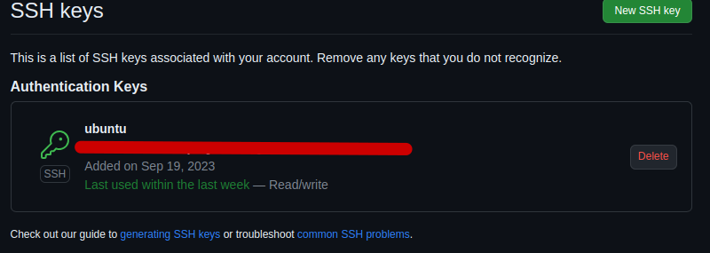
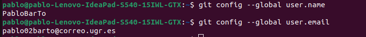

# Fantasy
Soy un jugador de la liga fantasy que es un juego en el que tienes que formar una plantilla con once jugadores que obtienen su puntación en función del partido, es decir, de lo bien o mal que jueguen, y gana la persona que tenga más puntos al final de todas las jornadas. Debido a esto cada semana no sé qué jugadores debo comprar para ser el que más puntos consiga cada jornada.

## Claves de github

## Correo y usuario

## Mis datos

